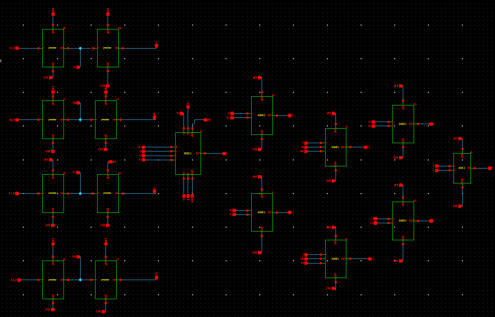
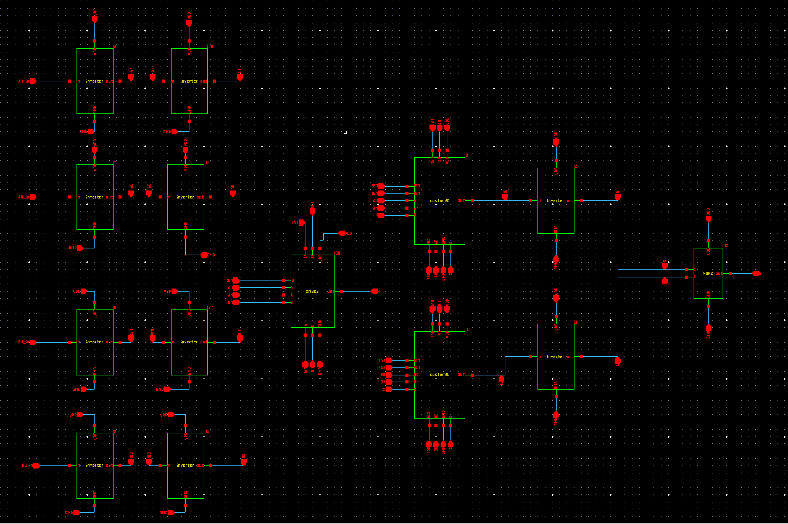
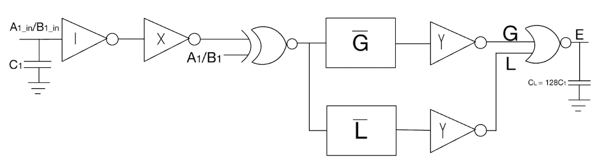
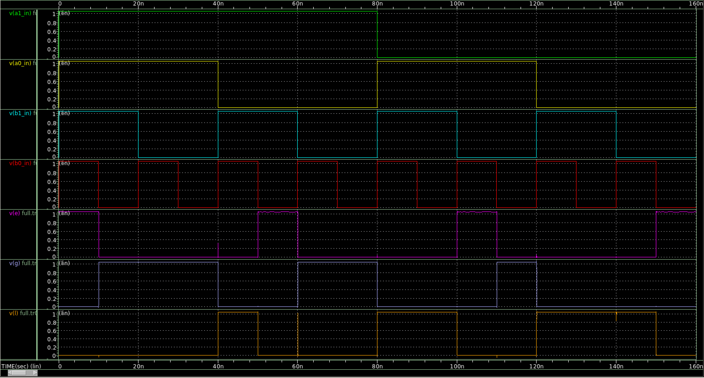

# 2-Bit Comparator (Transistor-Level CMOS)

**Full-custom static CMOS 2-bit magnitude comparator** designed at the transistor level with logic minimization, custom gate design, logical-effort–based sizing, and post-layout timing verification.

This project was completed as a final project for **EE103 (Intro to VLSI Design)** and focuses on **high-performance digital circuit optimization** using industry-standard tools and methodologies.

---

## 📌 Project Overview

This repository contains the design, optimization, and verification of a **2-bit magnitude comparator** implemented entirely in **static CMOS logic**.  
The comparator evaluates two 2-bit inputs (`A1 A0` and `B1 B0`) and produces three outputs:

- **G** — A > B  
- **E** — A = B  
- **L** — A < B  

The project emphasizes:
- Transistor-level design (no standard cells)
- Logic minimization and topology selection
- Custom pull-down network (PDN) gates
- Logical effort–based delay optimization
- HSPICE transient and timing analysis

---

## 🧠 Design Methodology

### 1. Logic Derivation
- Constructed the full truth table for all 16 input combinations
- Derived Boolean expressions for **G**, **L**, and **E**
- Optimized logic by setting  
  **E = ¬(G + L)** to minimize hardware
- Restricted implementation to **inverting logic only** for CMOS efficiency

### 2. Baseline Implementation
- Implemented using standard CMOS logic gates only
- Included:
  - XNOR
  - NAND
  - NOR
  - Inverters
- **Total transistor count:** 56

The schematic is shown below: 

This version was fully functional but not area- or speed-optimal.

---

## 🔧 Custom Gate Optimization

To reduce transistor count and delay:

- Designed **custom CMOS logic gates** for **G** and **L**
- Implemented Boolean expressions directly in the **pull-down network**
- Used complementary pull-up networks for static CMOS correctness

### Results:

| Metric | Baseline | Optimized |
|------|---------|----------|
| Transistor Count | 56 | **52** |
| Custom Gates | None | **G & L PDN gates** |

This reduced area and simplified the critical path.

The schematic is shown below: 

---

## ⏱️ Timing & Critical Path Analysis

### Critical Path
The longest delay occurs when the **MSBs (A1 or B1)** toggle:
A1/B1 -> XNOR -> Custom G/L Gate -> NOR -> E -> Output

- Verified using worst-case single-bit input transitions
- The **E output** dominates overall timing

### Pre-Optimization Delay
- Worst-case propagation delay: **≈ 17.1 ns**

---

## 🚀 Logical Effort Optimization

Applied **logical effort theory** to minimize delay:

- Computed:
  - Logical effort (G)
  - Branching effort (B)
  - Electrical effort (H)
- Determined:
  - Optimal stage effort
  - Optimal transistor widths for each gate
- Resized **every transistor** along the critical path

All sizing respected:
- μₙ / μₚ ≈ 1.6 (balanced inverter)
- Maximum transistor width constraints

---

## 📈 Final Performance Results

After transistor resizing and re-simulation:

### Worst-Case Delay (E output)
- **tPLH(max): 2.2355 ns**

### Average Delay
- **tp(avg): 1.93 ns**

### Speed Improvement

| Metric | Before | After |
|-----|-------|------|
| Worst-Case Delay | ~17.1 ns | **~2.24 ns** |
| Improvement | — | **~7.6× faster** |

### Maximum Operating Frequency
- **Worst-case:** ~447 MHz  
- **Average-case:** ~519 MHz

The waveform output showing correct functionality is below: 

---

## 🛠️ Tools & Technology

- **Synopsys Custom Compiler** — schematic design
- **HSPICE** — transient & timing simulation
- **32 nm CMOS PDK**
- Static CMOS (no dynamic or ratioed logic)

---

📄 **Full technical report:**  
See [`EE103_Final_Project.pdf`](https://drive.google.com/file/d/1LzzOUctUPfZyJDBPMk8dwX1nV7vOS_ef/view?usp=sharing) for complete derivations, schematics, and simulation results.

---

## 🎯 Key Takeaways

- Demonstrates an end-to-end custom CMOS design flow
- Shows practical application of logical effort
- Highlights tradeoffs between transistor number, size, and topology
- Emphasizes verification-driven design

This project reflects real-world custom digital IC design techniques used in high-performance datapaths and control logic.

---

## 👤 Author
**Cooper Bailey**  
Computer Engineering — Tufts University
